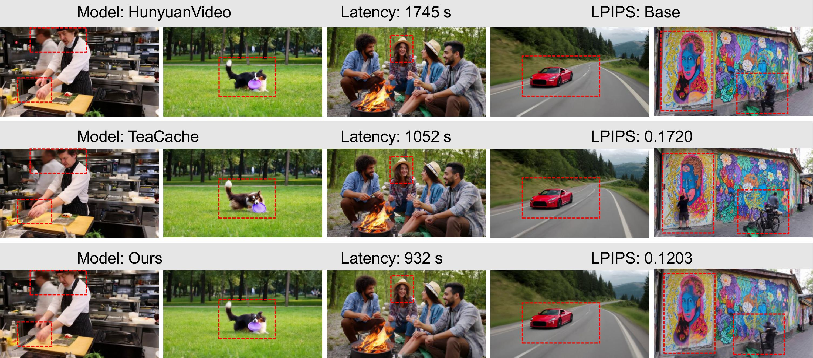
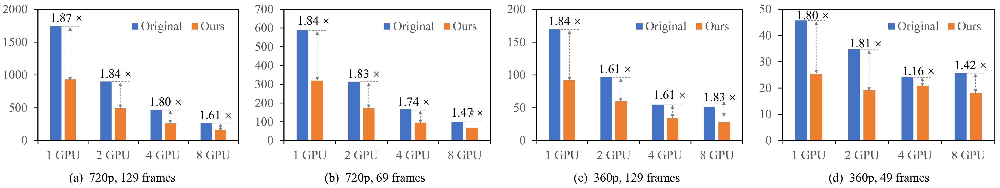

# ProfilingDiT

## Official Implementation of ["Model Reveals What to Cache: Profiling-Based Feature Reuse for Video Diffusion Models"]
## [📄 Paper](docs/Model_Reveals_What_to_Cache__Profiling_Based_Feature_Reuse_for_Video_Diffusion_Models.pdf)

This repository contains the official implementation of our paper: *Model Reveals What to Cache: Profiling-Based Feature Reuse for Video Diffusion Models*. Please follow the official link for setting up the environment.


## 🔥 Latest News
**Permalink: [🔥 Latest News](#latest-news)**  
• If you like our project, please give us a star ⭐ on GitHub for the latest update.  
• [2025/04/04] 🎉 Submitted to arXiv for review.  
• [2025/04/04] 🔥 Released open-source code for the latest model.  

## Running the Code

## Installation

Follow the official [HunyuanVideo](https://github.com/Tencent/HunyuanVideo) and [WAN 2.1](https://github.com/Wan-Video/Wan2.1) environment setup guide.

### HunyuanVideo

```sh
cd HunyuanVideo
python3 sample_video.py \
    --video-size 360 720 \
    --video-length 129 \
    --infer-steps 50 \
    --prompt "cat walk on grass" \
    --flow-reverse \
    --use-cpu-offload \
    --save-path ./results \
    --seed 42 \
    --model-base "ckpts" \
    --dit-weight "ckpts/hunyuan-video-t2v-720p/transformers/mp_rank_00_model_states.pt" \
    --delta_cache
```

### WAN 2.1

```sh
cd Wan2.1
python generate.py \
    --task t2v-14B \
    --size 832*480 \
    --frame_num 81 \
    --prompt "Two anthropomorphic cats in comfy boxing gear and bright gloves fight intensely on a spotlighted stage." \
    --delta_cache
```
## 📊 Quantitative Comparison

| Method | VBench ↑ | LPIPS ↓ | PSNR ↑ | SSIM ↑ | FID ↓ | Latency (ms) ↓ | Speedup ↑ |
|--------|---------|---------|--------|--------|--------|--------------|---------|
| **HunyuanVideo (720P, 129 frames)** [Kong et al. 2024](#) | **0.7703** | -- | -- | -- | -- | 1745 | -- |
| TeaCache (slow) [Tea et al.](#) | 0.7700 | 0.1720 | 21.91 | 0.7456 | 77.67 | 1052 | 1.66× |
| TeaCache (fast) [Tea et al.](#) | 0.7677 | 0.1830 | 21.60 | 0.7323 | 83.85 | **753** | **2.31×** |
| **Ours (HunyuanVideo)** | 0.7642 | **0.1203** | **26.44** | **0.8445** | **41.10** | 932 | 1.87× |
| **Wan2.1 (480P, 81 frames)** [Wan2.1 et al.](#) | 0.7582 | -- | -- | -- | -- | 497 | -- |
| TeaCache (fast) [Tea et al.](#) | 0.7604 | 0.2913 | 16.17 | 0.5685 | 117.61 | 249 | 2.00× |
| **Ours (Wan2.1)** | **0.7615** | **0.1256** | **22.02** | **0.7899** | **62.56** | **247** | **2.01×** |

**Table:** Quantitative comparison with prior methods under HunyuanVideo and Wan2.1 baselines.  
🔺 **Higher is better** for VBench, PSNR, SSIM, and Speedup.  
🔻 **Lower is better** for LPIPS, FID, and Latency.
## 🚀 Scale to Multi-GPU

Our method efficiently scales across multiple GPUs to accelerate inference and training. By leveraging model parallelism and optimized memory management, we achieve significant speedup without compromising quality.


# To-Do List:
- [ ] OpenSora2
- [ ] CogVideoX
