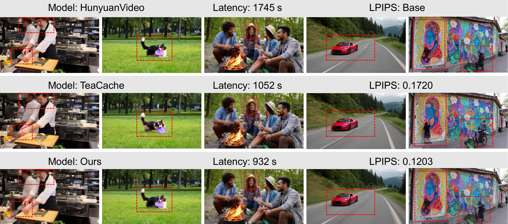
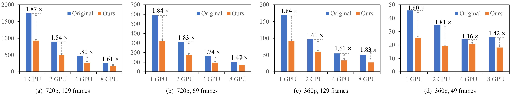

# ProfilingDiT

### Official Implementation of ["Model Reveals What to Cache: Profiling-Based Feature Reuse for Video Diffusion Models"]
## [📄Paper](https://openaccess.thecvf.com/content/ICCV2025/papers/Ma_Model_Reveals_What_to_Cache_Profiling-Based_Feature_Reuse_for_Video_ICCV_2025_paper.pdf) [🔗arXiv](https://arxiv.org/pdf/2504.03140)

This repository contains the official implementation of our paper: *Model Reveals What to Cache: Profiling-Based Feature Reuse for Video Diffusion Models*.  
Please follow the official link for setting up the environment.



---

## 📌 Table of Contents
- [🔥 Latest News](#-latest-news)
- [📀 Installation](#-installation)
- [🚀 Running the Code](#-running-the-code)
- [📊 Quantitative Comparison](#-quantitative-comparison)
- [⚡ Scale to Multi-GPU](#-scale-to-multi-gpu)
- [📝 To-Do List](#-to-do-list)

---

## 🔥 Latest News
🔔 **[Latest News](#latest-news)**  
• If you like our project, please give us a star ⭐ on GitHub for the latest update.  
• **🚨 Received by ICCV 2025** 🎉  
• **[2025/04/04]** 🎉 Submitted to arXiv.  
• **[2025/04/04]** 🔥 Released open-source code for the latest model.  

---

## 📀 Installation

Follow the official [HunyuanVideo](https://github.com/Tencent/HunyuanVideo) and [WAN 2.1](https://github.com/Wan-Video/Wan2.1) environment setup guide.

```sh
pip install -r requirements.txt
```

---

## 🚀 Running the Code

### **HunyuanVideo**
```sh
cd HunyuanVideo
python3 sample_video.py \
    --video-size 360 720 \
    --video-length 129 \
    --infer-steps 50 \
    --prompt "cat walk on grass" \
    --flow-reverse \
    --use-cpu-offload \
    --save-path ./results \
    --seed 42 \
    --model-base "ckpts" \
    --dit-weight "ckpts/hunyuan-video-t2v-720p/transformers/mp_rank_00_model_states.pt" \
    --delta_cache
```

### **WAN 2.1**
```sh
cd Wan2.1
python generate.py \
    --task t2v-14B \
    --size 832*480 \
    --frame_num 81 \
    --prompt "Two anthropomorphic cats in comfy boxing gear and bright gloves fight intensely on a spotlighted stage." \
    --delta_cache
```

---

## 📊 Quantitative Comparison

### HunyuanVideo Baseline

| Method | VBench ↑ | LPIPS ↓ | PSNR ↑ | SSIM ↑ | FID ↓ | Latency (ms) ↓ | Speedup ↑ |
|--------|---------|---------|--------|--------|--------|--------------|---------|
| **HunyuanVideo (720P, 129 frames)** | **0.7703** | -- | -- | -- | -- | 1745 | -- |
| TeaCache (slow) [Tea](https://github.com/ali-vilab/TeaCache) | 0.7700 | 0.1720 | 21.91 | 0.7456 | 77.67 | 1052 | 1.66× |
| TeaCache (fast) [Tea](https://github.com/ali-vilab/TeaCache) | 0.7677 | 0.1830 | 21.60 | 0.7323 | 83.85 | **753** | **2.31×** |
| **Ours (HunyuanVideo)** | 0.7642 | **0.1203** | **26.44** | **0.8445** | **41.10** | 932 | 1.87× |

### Wan2.1 Baseline

| Method | VBench ↑ | LPIPS ↓ | PSNR ↑ | SSIM ↑ | FID ↓ | Latency (ms) ↓ | Speedup ↑ |
|--------|---------|---------|--------|--------|--------|--------------|---------|
| **Wan2.1 (480P, 81 frames)** | 0.7582 | -- | -- | -- | -- | 497 | -- |
| TeaCache (0.2thres) [Tea](https://github.com/ali-vilab/TeaCache) | 0.7604 | 0.2913 | 16.17 | 0.5685 | 117.61 | 249 | 2.00× |
| **Ours (Wan2.1)** | **0.7615** | **0.1256** | **22.02** | **0.7899** | **62.56** | **247** | **2.01×** |

**Tables:** Quantitative comparison with prior methods under HunyuanVideo and Wan2.1 baselines.  
🔺 **Higher is better** for VBench, PSNR, SSIM, and Speedup.  
🔻 **Lower is better** for LPIPS, FID, and Latency.


---

## ⚡ Scale to Multi-GPU

Our method efficiently scales across multiple GPUs to accelerate inference and training.  
By leveraging **model parallelism**, **NCCL communication**, and **optimized memory management**, we achieve significant speedup without compromising quality.

### 🔑 Key Features:
- **Increased Throughput** 🚀: Distributes computation across multiple GPUs to process more frames in parallel.
- **Optimized Memory Usage** 🔧: Dynamically allocates memory to prevent bottlenecks.
- **Flexible Deployment** 💡: Works seamlessly on both single-node and distributed setups.
- **NCCL Optimization** 🔄: Uses efficient GPU-GPU communication to minimize overhead.



For detailed setup and configurations, please refer to our [Multi-GPU Guide](./docs/multi_gpu.md). 🚀

---

## 📝 To-Do List:
- [ ] **OpenSora2** 🏗️ (Upcoming Support)
- [ ] **Optimize Caching for CogVideoX** ⚙️

---
## 📚 Citation

```bibtex
@misc{ma2025modelrevealscacheprofilingbased,
      title={Model Reveals What to Cache: Profiling-Based Feature Reuse for Video Diffusion Models}, 
      author={Xuran Ma and Yexin Liu and Yaofu Liu and Xianfeng Wu and Mingzhe Zheng and Zihao Wang and Ser-Nam Lim and Harry Yang},
      year={2025},
      eprint={2504.03140},
      archivePrefix={arXiv},
      primaryClass={cs.CV},
      url={https://arxiv.org/abs/2504.03140}, 
}
```
## 📜 License
This project is licensed under the Apache 2.0 License.